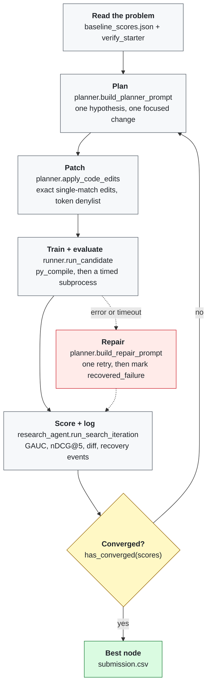

<div align="center">


# Kopibara

**An autonomous ML research agent that runs the MLE iteration loop on KuaiRand-Pure: it
reads the benchmark, writes the code, measures itself, and stops when progress levels
off.**

[](./pyproject.toml)
[](https://docs.astral.sh/uv/)
[](https://lightgbm.readthedocs.io/)
[](./LICENSE)

</div>

Kopibara turns a benchmark into a bounded code-search problem. Given the organizer's
KuaiRand-Pure contract, it proposes a testable hypothesis, patches one candidate script,
runs it in a sandboxed subprocess, reads the validation metrics, and keeps the winner.
It repeats until convergence, a configured cap, or another terminal condition.

> [!NOTE]
> The agent never sees the hidden test split. It develops on train plus public
> validation feedback only, and the dataset adapter strips test labels before rows
> reach any generated code. See [Leakage control](#leakage-control).

---

## Table of Contents

- [Results](#results)
- [Quick start](#quick-start)
- [How the loop works](#how-the-loop-works)
- [Design rationale](#design-rationale)
- [Leakage control](#leakage-control)
- [Autonomy and robustness](#autonomy-and-robustness)
- [Reproducing the results](#reproducing-the-results)
- [Repository layout](#repository-layout)
- [Candidate library](#candidate-library)
- [Limitations and next steps](#limitations-and-next-steps)
- [Team](#team)
- [License](#license)
- [Acknowledgments](#acknowledgments)

---

## Results

**KuaiRand-Pure (required benchmark).** Validation-best checkpoint from a converged
autonomous run, compared with the organizer's published FM baseline.

| Metric | Official FM baseline | Kopibara | Absolute delta |
| :--- | ---: | ---: | ---: |
| GAUC | 0.6674 | **0.7059** | **+0.0385** |
| nDCG@5 | 0.5357 | **0.5538** | **+0.0181** |
| Primary (mean of the two) | 0.6016 | **0.6299** | **+0.0283** |

The primary score is the equal-weighted mean of GAUC and nDCG@5. This run improves on
the FM baseline by **+0.0283**.

The validation primary has a dataset-specific attainable range below 1.0. An oracle that
scores rows with their true labels reaches 0.8484, while random scoring sits at 0.4834,
because 27.1% of users have no positive label at all. Read scores against that range:

| Reference rung | Validation primary | Share of attainable range |
| :--- | ---: | ---: |
| Random scoring | 0.4834 | 0% |
| Item popularity | 0.5807 | 26.7% |
| Official FM baseline | 0.6016 | 32.4% |
| **Kopibara** | **0.6299** | **40.1%** |
| Oracle ceiling | 0.8484 | 100% |

**Resource consumption to reach the converged result.**

| Measure | Value |
| :--- | ---: |
| Iterations used (cap 50) | 4 |
| Stop reason | `converged` (ε = 0.002, N = 3) |
| Agent wall-clock | 6 min 16 s |
| LLM tokens (input + output) | 13,901 + 2,390 = **16,291** |
| GPU-hours | 0 (CPU only) |
| Manual interventions | **0** |

<details>
<summary><b>KuaiRand-1K (bonus benchmark)</b></summary>

| Metric | Kopibara (validation) |
| :--- | ---: |
| GAUC | 0.6853 |
| nDCG@5 | 0.6166 |
| Primary | 0.6509 |

The starter kit publishes no official baseline for KuaiRand-1K, so no delta is claimed.
The number is reported as an absolute validation score from the same pipeline, retrained
on the 1K splits. KuaiRand-27K was not attempted.

</details>

## Quick start

1. **Clone and install**

   ```bash
   git clone https://github.com/oadultradeepfield/kopibara-agent.git
   cd kopibara-agent
   make install
   ```

   `make install` runs `uv sync --all-groups`. Python 3.12 or newer is required.

2. **Place the benchmark data**

   Extract the organizer's archive so the CSVs land here:

   ```text
   kuairand-starter-kit/KuaiRand-Pure/data/
   ```

   The archives and every generated artifact are untracked by Git. For the bonus
   benchmark, use `kuairand-starter-kit/KuaiRand-1K/data/`.

3. **Verify the benchmark contract**

   ```bash
   make verify-starter
   ```

   This asserts that the label is `long_view`, that the date splits and the metric pair
   match the organizer's specification, and that the published baseline scores are the
   ones the agent will be measured against. It fails loudly if the kit has drifted.

4. **Run the checks**

   ```bash
   make check
   ```

   Runs `ruff`, `mypy --strict`, `pytest`, and the starter-kit contract check.

5. **Run the agent**

   ```bash
   export OPENAI_API_KEY="your_api_key_here"
   uv run kopibara-agent --run
   ```

   Iteration logs, the best solution, and a schema-checked `submission.csv` are written
   to a timestamped directory under `runs/autonomous/`.

<details>
<summary><b>Command-line options</b></summary>

| Flag | Default | Purpose |
| :--- | :--- | :--- |
| `--run` | off | Run the full autonomous search. |
| `--check-api` | off | Print the configured model and whether the key is set. Makes no API call. |
| `--prompt TEXT` | none | Send one prompt to the model. Useful for smoke-testing credentials. |
| `--data-dir PATH` | `kuairand-starter-kit/KuaiRand-Pure/data` | Benchmark split directory. |
| `--log-dir PATH` | `runs/autonomous` | Parent directory for run logs. |
| `--max-iterations N` | `50` | Hard iteration cap. |
| `--wall-clock-hours H` | `6.0` | Wall-clock ceiling for the whole run. |
| `--candidate-timeout-seconds S` | `900` | Per-candidate subprocess timeout. |

The default client uses the OpenAI Responses API with `gpt-5.6-luna` at low reasoning
effort. Credentials are read from the environment at runtime and are never written to
the repository.

</details>

## How the loop works

The five stages of the MLE iteration loop map onto concrete modules. The benchmark
contract supplies the task definition; the controller and model make the remaining
search decisions. Dashed edges show the recovery path.



Each iteration selects the highest-scoring measured node as its parent, so the search is
best-first over a solution tree rather than a linear chain. A candidate that fails is
kept in the tree as a `recovered_failure` and excluded from parent selection, which stops
the search from repeatedly re-expanding a branch it cannot run.

## Design rationale

**Search over code, not over hyperparameters.** A grid search cannot invent a feature or
switch a loss function. Following AIDE, the agent's action space is an exact textual patch
to a runnable Python script, so a single iteration can change the objective, the feature
construction, or the training schedule with the same mechanism.

**The seed candidate is deliberately ordinary.** `experiments/history_lgbm.py` is a
LightGBM ranker over lagged user, item, author, and user-item feedback aggregates. It is
strong enough that improvements have to be real, and plain enough to support controlled
code search. Starting from a clever candidate would have made the agent's contribution
unmeasurable.

**The planner is told what has already failed.** The prompt carries the full solution
tree: every node's title, hypothesis, and validation score. It also carries the
organizer's finding that static feature additions and larger FM embeddings were already
measured as non-improvements. The agent spends its budget on hypotheses that have not
been ruled out.

**Edits are exact-match replacements, not regenerated files.** Each edit must match its
anchor text exactly once, or the iteration is rejected before anything runs. This keeps
diffs reviewable, gives the run log a real `unified_diff` per iteration, and makes a
malformed patch a cheap failure rather than a silently broken script.

**Patches are checked against a token denylist.** A candidate may not introduce
`subprocess`, `socket`, `requests`, `urllib`, `httpx`, `openai`, `os.system`, `eval(`,
`exec(`, or `__import__` if the parent did not already contain it. The generated code is
untrusted by construction; a research agent that can open a socket is a different and
much harder thing to reason about.

**Convergence uses the organizer's own rule.** ε = 0.002 over N = 3 consecutive
iterations, checked against the cumulative best. The 50-iteration cap and the 6-hour
wall-clock ceiling are backstops, not the expected exit. The reported score is the
converged result rather than the peak, because a peak selected over 50 tries is partly
noise.

### What the agent actually found

The converged run is four iterations long, and the log reads as a research trace rather
than a hyperparameter sweep.

| Iter | Hypothesis | Validation primary | Kept |
| :--- | :--- | ---: | :--- |
| 0 | Seed candidate: lagged multi-feedback history features | 0.6257 | ✓ |
| 1 | Truncate LambdaRank at 5 to concentrate gradients on the scored region | **0.6299** | ✓ |
| 2 | Widen truncation to 10 to trade nDCG@5 for GAUC | 0.6264 | ✗ |
| 3 | Disable per-query lambda normalization to match impression-weighted GAUC | 0.6268 | ✗ |
| 4 | Swap LambdaRank for the XE_NDCG listwise objective | 0.6193 | ✗ |

Iteration 1 is the improvement that stuck, and it is a metric-alignment argument rather
than a tuning result: the evaluator scores nDCG@5, so the ranking loss should spend its
pairwise gradient budget on the top five positions. Iterations 2 through 4 are the agent
probing that boundary from three directions and finding it holds, which is what triggers
the convergence rule.

## Leakage control

The hidden test split is enforced by review, not by withholding the file, so the
guarantees have to be visible in the code.

| Guarantee | Where it is enforced |
| :--- | :--- |
| Test labels never reach candidate code | `kuairand_dataset.mask_test_labels` and `mask_test_feedback` strip labels and feedback from test rows before they are returned |
| Test predictions are written but never scored during search | Candidates emit `test_scores.npy`; only `valid` metrics are parsed by `runner.parse_candidate_metrics` |
| Model selection uses validation only | Experiments select checkpoints from validation metrics; test labels are not used for selection |
| No external training data | Training reads only the split directory passed on the command line |
| The API key never reaches candidate code | `runner.build_environment` pops `OPENAI_API_KEY` before spawning the subprocess |
| The evaluator is outside the edit boundary | The planner may edit `history_lgbm.py` and nothing else; `evaluate.py`, `data.py`, and the controller are immutable |

`log_random_4_22_to_5_08_pure.csv` is not loaded by any training path, because its date
range overlaps the validation and test windows.

## Autonomy and robustness

**Autonomy.** The reported run required **zero manual interventions**. The agent selects
its own parent node, writes its own hypothesis, generates the patch, decides when to stop,
and produces the final submission. Every iteration log records
`"manual_interventions": 0` and `"hidden_test_access": false`, so the claim is auditable
per iteration rather than asserted once.

**Robustness.** Failure handling is layered, and each layer writes to the log instead of
crashing the run:

- A malformed plan is re-requested once, and both parse errors are kept in
  `planner_recovery`.
- A candidate that raises, times out, or emits no metric line triggers one repair round:
  the failure text is sent back with the original hypothesis, and the repaired candidate
  is rerun. Success is logged as `candidate repaired and rerun`.
- If candidate stdout lacks a metric line, the runner reads the candidate's `metrics.json`
  artifact before declaring a failure.
- A repair that fails again marks the node `recovered_failure`. The score series is
  extended with the current best so a failed branch neither advances nor resets the
  convergence window, and the search continues from a different parent.
- Every subprocess is bounded by `--candidate-timeout-seconds`, clamped so a single
  candidate can never overrun the remaining wall-clock budget.
- If the final submission step fails, the manifest records
  `stopped_reason: submission_failure` with the error rather than discarding the run.

## Reproducing the results

<details>
<summary><b>Full autonomous run</b></summary>

```bash
export OPENAI_API_KEY="your_api_key_here"
uv run kopibara-agent --run --data-dir kuairand-starter-kit/KuaiRand-Pure/data
```

Output lands in `runs/autonomous/<UTC timestamp>/`:

| Artifact | Contents |
| :--- | :--- |
| `000_root.json` … `NNN_NNN-child.json` | One record per iteration: hypothesis, unified diff, validation metrics, recovery events, token counts |
| `manifest.json` | Baseline, best node, iteration count, wall-clock, total tokens, the full node tree, submission path |
| `best_solution.py` | The winning candidate source |
| `best_output/` | Its model artifacts and `test_scores.npy` |
| `submission.csv` | Row-aligned and validated with the organizer's `submit.py --check` |

</details>

<details>
<summary><b>Deterministic pipeline, no LLM calls</b></summary>

Reruns the converged recipe across three seeds plus a target-only expert and blends them.
This verifies the pipeline without spending tokens.

```bash
make history-pipeline
```

Writes to a timestamped directory under `runs/history-pipeline/`, with the same
per-iteration JSON records and a row-aligned submission. The blended validation primary is
0.6274, slightly below the single best autonomous checkpoint at 0.6299. The ensemble buys
variance reduction, not score.

</details>

<details>
<summary><b>Individual candidates</b></summary>

```bash
make history        # LightGBM ranker over lagged multi-feedback history
make lambdarank     # LightGBM LambdaRank over static metadata only
make pairwise       # pairwise-loss Factorization Machine on the official FM
make deepfm         # DeepFM / PLE multi-feedback comparison
make bonus-1k-lgbm  # KuaiRand-1K bonus benchmark
```

</details>

> [!IMPORTANT]
> `runs/` is untracked by Git, so a fresh clone contains no logs or model artifacts. The
> commands above regenerate them. For an autonomous run, the printed directory contains
> the complete record: one JSON file per iteration, a manifest, the winning source, and
> the submission.

## Repository layout

```text
kopibara-agent/
├── src/kopibara_agent/
│   ├── cli.py             # entry point and run configuration
│   ├── research_agent.py  # best-first tree search, recovery, logging, manifest
│   ├── planner.py         # prompt construction, plan parsing, patch validation
│   ├── runner.py          # sandboxed subprocess execution, metric parsing, submission
│   ├── models.py          # frozen value objects for plans, nodes, metrics
│   └── constants.py       # model, budgets, convergence rule, token denylist
├── experiments/           # runnable candidates and the KuaiRand adapter
├── kuairand-starter-kit/  # organizer contract: baseline, evaluator, submission schema
├── scripts/               # contract checks and Git hooks
├── tests/                 # controller parsing, stopping rule, credential boundary
└── frontend/              # run-log dashboard (not part of the scored pipeline)
```

## Candidate library

The autonomous controller edits `history_lgbm.py`; the repository also carries several
modelling families for comparison without changes to the controller.

| Script | Approach |
| :--- | :--- |
| `history_lgbm.py` | Lagged user, item, author, and user-item feedback aggregates with grouped LightGBM ranking. The default seed candidate. |
| `lambdarank.py` | Grouped LightGBM LambdaRank over static metadata, with a pointwise binary fallback. |
| `pairwise_fm.py` | The official Factorization Machine retrained with a same-user pairwise logistic loss. |
| `deepfm_mtl.py` | DeepFM and a one-layer PLE tower over the twelve KuaiRand feedback signals. |
| `din_ranker.py` | Candidate-aware attention over each user's chronological video history. |
| `ensemble_submission.py` | Z-normalized blending of score arrays into one aligned submission. |

## Limitations and next steps

**The search is narrow by construction.** The planner edits one file, and the run
converged after four iterations. Allowing edits to the feature-construction module
alongside the training script would expose more of the stack. The token denylist would
also need to grow with it.

**Convergence fires early on a flat landscape.** ε = 0.002 over three iterations is the
organizer's default, and around the 0.63 region the per-iteration deltas are close to that
threshold. A run exploring a genuinely different branch, such as a deep model or a
different label treatment, might stop before that branch has a chance to pay off. A
minimum-iteration floor before the convergence window opens would reduce this risk.

**No off-policy evaluation.** KuaiRand ships randomized-exposure logs that support
counterfactual evaluation, but those logs are not used here. They cannot enter training
under the temporal-split rule, but they could inform a debiasing term or a validation-time
sanity check on the ranker's exposure bias.

**Single-node search.** The tree is explored one candidate at a time. Candidates are
independent subprocesses, so running several branches in parallel is a scheduling change
rather than an architectural one. Parallel execution would allow wider exploration inside
the same wall-clock budget.

**Deep models were explored but not selected.** `deepfm_mtl.py` and `din_ranker.py` run
and are logged, but neither beat the gradient-boosted ranker on Pure at this scale. A
larger budget for the multi-task tower would provide a fairer comparison than treating it
as one candidate among several.

## Team

| Member | Contributions |
| :--- | :--- |
| **Phanuphat Srisukhawasu** | Agent controller, tree search and recovery, planner prompts and patch validation, run logging and manifest |
| **Supachod Trakansirorut** | Candidate experiments and feature engineering, KuaiRand adapter and leakage controls, evaluation and submission tooling |

## License

Released under the [MIT License](./LICENSE).

## Acknowledgments

- **[AIDE](https://arxiv.org/abs/2502.13138)** (Weco AI) for framing ML engineering as
  tree search over code, which is the idea this agent is built on.
- **[MLE-bench](https://arxiv.org/abs/2410.07095)** (OpenAI) for establishing what an
  autonomous ML agent should be measured on.
- **[The AI Scientist-v2](https://arxiv.org/abs/2504.08066)** (Sakana AI) for the
  hypothesis-driven agentic search loop.
- **[KuaiRand](https://kuairand.com)** (Kuaishou) for releasing a short-video dataset with
  randomized exposure and twelve feedback signals.
- **[LightGBM](https://github.com/microsoft/LightGBM)** for the ranking implementation
  used by the winning candidate.
